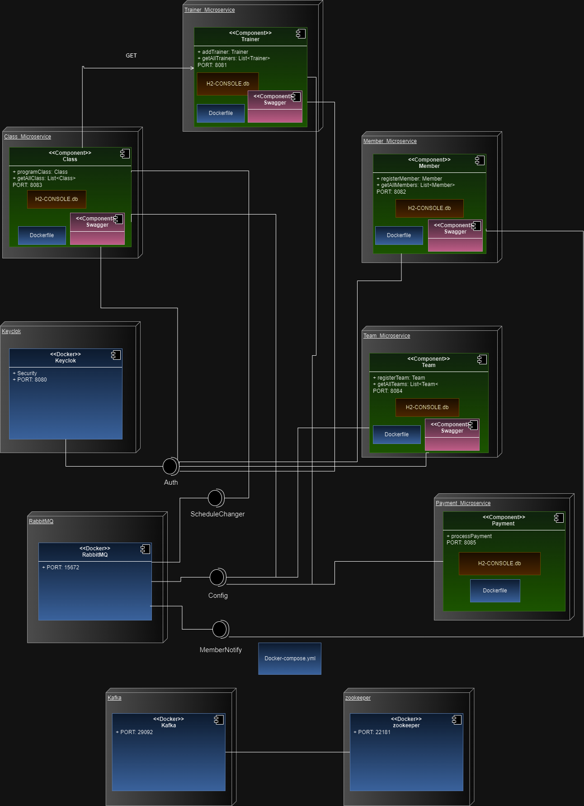

# Gym Management Project with Microservices

This project is a gym management system designed using a microservices architecture. Each microservice is responsible for a specific part of the gym's functionality, allowing for high scalability and maintainability of the system.

## Project Specifications

### Microservices

1. **Member Microservice**
   - **Responsibility**: Management of gym members.
   - **Database**: Members database.
   - **Endpoints**:
     - `POST /members`: Create a new member.
     - `GET /members`: Retrieve all members.

2. **Class Microservice**
   - **Responsibility**: Management of scheduled gym classes.
   - **Database**: Classes database.
   - **Endpoints**:
     - `POST /class`: Schedule a new class.
     - `GET /class`: Retrieve all classes.

3. **Trainer Microservice**
   - **Responsibility**: Management of trainers.
   - **Database**: Trainers database.
   - **Endpoints**:
     - `POST /trainer`: Create a new trainer.
     - `GET /trainer`: Retrieve all trainers.

4. **Team Microservice**
   - **Responsibility**: Management of gym equipment.
   - **Database**: Equipment database.
   - **Endpoints**:
     - `POST /team`: Create a new team.
     - `GET /team`: Retrieve all teams.

**Architecture Design**
   - Creation of an architecture diagram illustrating the relationship between microservices and their databases.
   

https://drive.google.com/file/d/1oIcTH7_EvVnRKV65AhUcJzeUh7r7hcnS/view?usp=sharing

## Keycloak Configuration

1. **Create a Realm:** Set up a new Realm in Keycloak for your application.
2. **Create Clients:**
    - Go to the "Clients" section and create a new client named `Team-services`.
    - Configure the following parameters:
      - `Client ID`: `Team-services`
      - `Client Protocol`: `openid-connect`
      - `Access Type`: `confidential`
    - Ensure the following authentication flows are enabled:
      - `Standard Flow Enabled`: `true`
      - `Direct Access Grants Enabled`: `true`
    - Add the `Redirect URIs`:
      - `http://localhost:8080/*`
      - `http://localhost:8084/*`
3. **Create Roles:**
    - Create roles for your application: `ROLE_MEMBER`, `ROLE_TRAINER`, `ROLE_ADMIN`.
4. **Create Users:**
    - Create users in Keycloak and assign the corresponding roles.

Authentication using postman


## API Documentation with Swagger

Swagger is integrated to provide an interactive user interface for API documentation. To access the Swagger documentation:

- Ensure the application is running.
- Navigate to: `http://localhost:8080/swagger-ui.html` or `http://localhost:8084/swagger-ui.html`

Team-microservices example


🐇 RabbitMQ Implementation
--------------------------

En este proyecto, hemos implementado RabbitMQ como middleware de mensajería para manejar diferentes patrones de comunicación entre microservicios. A continuación, se describe cómo se implementaron las principales funcionalidades de RabbitMQ, incluyendo el sistema de notificaciones para nuevas inscripciones, el patrón publish/subscribe para cambios en los horarios de clases y el manejo de la Dead Letter Queue (DLQ) para los pagos fallidos.

### Instalación de RabbitMQ

Para comenzar, asegúrate de que RabbitMQ esté instalado y funcionando localmente o en un servidor. Si aún no lo tienes instalado, puedes hacerlo ejecutando el siguiente comando:

```bash
docker run -d --name rabbitmq -p 5672:5672 -p 15672:15672 rabbitmq:3-management
```

Una vez iniciado el contenedor, puedes acceder al panel de administración de RabbitMQ en `http://localhost:15672` con las credenciales por defecto:

*   Usuario: `guest`
*   Contraseña: `guest`

* * *

### Configuración de RabbitMQ en el código
En cada microservicio hemos creado una clase de configuración [RabbitMQConfig.java](/Class_Microservice/src/main/java/com/icesi/edu/co/config/ClassRabbitConfig.java) para definir los intercambios, colas y bindings.

### Sistema de Notificaciones para Nuevas Inscripciones
El sistema de notificaciones para nuevas inscripciones se implementa utilizando un patrón de cola simple en el microservicio de Members. Cada vez que un nuevo miembro se registra, se publica un mensaje en una cola de RabbitMQ, que posteriormente es consumido por un servicio que envía una notificación.

### Patrón Publish/Subscribe para Horarios de Clases

Para implementar un patrón **publish/subscribe** en el microservicio de **Classes**, utilizamos un `FanoutExchange`. Este tipo de intercambio distribuye mensajes a todas las colas enlazadas a dicho exchange, lo que nos permite notificar a múltiples consumidores cada vez que hay un cambio en los horarios de clases.

#### Configuración del intercambio `FanoutExchange`
```java

@Bean
public FanoutExchange scheduleChangeExchange
() {
    return new FanoutExchange("schedule-change-exchange");
}
```
#### Publicación de cambios de horario

Cada vez que se programa una nueva clase o se modifica un horario, se publica un mensaje de notificación:

```java

public void notifyScheduleChange
(String classDetails) {
    rabbitTemplate.convertAndSend("schedule-change-exchange", "", "Cambio de horario: " + classDetails);
}
```
## How to Run the Project

1. Clone the Repository
   ```bash
   git clone https://github.com/juanpabblo16/GYM_Management.git

2. Open each microservice in a separate project in IntelliJ.
3. Run the projects.
4. Test the endpoints with Postman.

## Authors

- Jesus Garces
- Juan Pablo Acevedo
- Juan Sebastian Diaz
