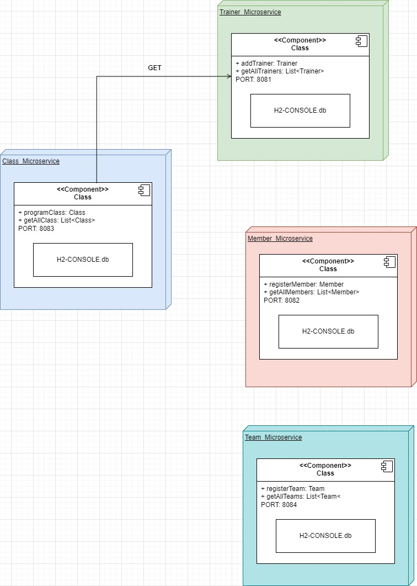

# Gym Management Project with Microservices

This project is a gym management system designed using a microservices architecture. Each microservice is responsible for a specific part of the gym's functionality, allowing for high scalability and maintainability of the system.

## Project Specifications

### Microservices

1. **Member Microservice**
   - **Responsibility**: Management of gym members.
   - **Database**: Members database.
   - **Endpoints**:
     - `POST /members`: Create a new member.
     - `GET /members`: Retrieve all members.

2. **Class Microservice**
   - **Responsibility**: Management of scheduled gym classes.
   - **Database**: Classes database.
   - **Endpoints**:
     - `POST /class`: Schedule a new class.
     - `GET /class`: Retrieve all classes.

3. **Trainer Microservice**
   - **Responsibility**: Management of trainers.
   - **Database**: Trainers database.
   - **Endpoints**:
     - `POST /trainer`: Create a new trainer.
     - `GET /trainer`: Retrieve all trainers.

4. **Team Microservice**
   - **Responsibility**: Management of gym equipment.
   - **Database**: Equipment database.
   - **Endpoints**:
     - `POST /team`: Create a new team.
     - `GET /team`: Retrieve all teams.

## Implementation Steps

1. **Defining Requirements**
   - Identification of bounded contexts and responsibility segregation.
   - Definition of endpoints and interaction between microservices.

2. **Architecture Design**
   - Creation of an architecture diagram illustrating the relationship between microservices and their databases.
   

Link:[https://drive.google.com/file/d/1oIcTH7_EvVnRKV65AhUcJzeUh7r7hcnS/view?usp=sharing]
3. **Microservice Implementation**
   - Configuration of projects with Spring Boot.
   - Creation of entities, repositories, services, and controllers for each microservice.
   - Implementation of communication between microservices.

4. **Database Configuration**
   - Definition of database structures for each microservice.

5. **Documentation and Deployment**
   - Preparation of project documentation.
   - Local deployment of the microservices.

## How to Run the Project

1. Clone the Repository
   ```bash
   git clone https://github.com/juanpabblo16/GYM_Management.git

2. Open each microservice in a separate project in IntelliJ.
3. Run the projects.
4. Test the endpoints with Postman.

## Technologies Used

- **Spring Boot**: Main framework for microservice development.
- **Spring Data JPA**: For persistence management and interaction with databases.
- **H2 Database**: In-memory database used for development and testing
- **Postman**: Tool for testing API endpoints.
- **Draw io**: Tool for creating UML diagrams of the system architecture.
- **Maven**: Project management and build automation tool.

## Authors

- Jesus Garces
- Juan Pablo Acevedo
- Juan Sebastian Diaz
